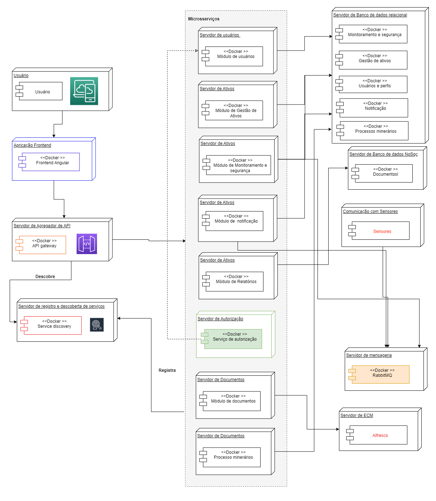
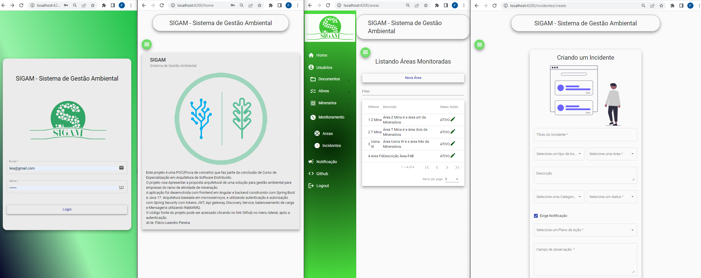

# POC do Projeto Arquitetural de um sistema de gestão ambiental

O código fonte é referente ao projeto desenvolvido como parte do TCC, do curso de especialização em Arquitetura de Software Distribuído da Puc Minas 🔥 [Arquitetura de Software Distribuído - PUC Minas](https://www.pucminas.br/PucVirtual/Pos-Graduacao/Paginas/Arquitetura-de-Software-Distribuido.aspx) 🔥

Nesse trabalho foi desenvolvido um projeto arquitetural, e uma implementação parcial(POC) para exemplificar e validar alguns requisitos de qualidade.
A aplicação foi desennvolvida com a separação entre frontend e backend. O backend foi implementado com uma arquitetura baseada em microsserviços utlizando **[Spring Boot](https://spring.io/projects/spring-boot). O frontend foi desenvolvido em **[Angular](https://angular.io/)  utilizando a biblioteca de componentes Angular Material. Conforme demonstrado na imagem abaixo, a aplicação é composta de vários componentes que se relacionam para permitir uma solução que seja flexível, escalável, resiliente e alinhada a evolução tecnológica. A solução entregue na proposta arquitetural, visa promover a melhoria e controle das atividades, bem como auxiliar no cumprimento das leis e normas ambientais, evitar perdas e falhas no processo devido a falta de informação, e minimizar a possibilidade de prejuízos devido a multas por falta de cumprimento de prazos.

Abaixo detalhes das partes envolvidas. Foi utilizado como base o Spring Cloud, que auxilia na criação de aplicações distribuídas e escaláveis. Como parte da arquitetura temos  **Api Gateway**, **Service Registry** , **Config Server**, **Feign**, **Load Balancer**, além de utilizar o servidor de mensageria **RabbitMQ** e **Spring security**.

- **[Api Gateway](https://cloud.spring.io/spring-cloud-gateway/reference/html/):** Microsserviço responsável por roteamento dinâmico e que fornece uma maneira simples e eficaz de encaminhar solicitações recebidas para o destino apropriado. Através dele os clientes poderão realizar chamadas as nossas API’s, pois nosso gateway se comunica com o Eureka(**Service Registry**), obtendo todos os serviços registrados e cria uma rota dinâmica para esses serviços, até mesmo realiza o balanceamento de carga das requisições.
- **[Service Registry](https://spring.io/guides/gs/service-registration-and-discovery/)**: O Eureka é o Service Discovery utilizado no Server e no Client. O cliente se registra no servidor e este fica responsável por fazer a localização do serviço requisitado.O Eureka Server assume o papel de mediador da comunicação e delega a requisição para uma das instância que respondem pelo serviço utilizando alguma estratégia de balanceamento, como round-robin, por exemplo.

- **[Config Server](https://spring.io/projects/spring-cloud-config)**: É um servidor de configurações facilmente integrado com aplicações Spring Boot, o qual tem objetivo de gerenciar externamente e disponibilizar as configurações para as aplicações de forma centralizada, além de proporcionar algumas features como: atualização de properties sem a necessidade de restart, versionamento das configurações, reaproveitamento de properties entre aplicações e criptografia de properties.

- **[Feign](https://docs.spring.io/spring-cloud-openfeign/docs/current/reference/html/)**: O Feign foi criado com o objetivo de reduzir a complexidade para consumir esses serviços. O Feign proporciona implementações com base em anotações, assim os mapeamentos para os clients HTTP podem ser desenvolvidos baseados em interfaces.

- **[Load Balancer](https://www.tutorialspoint.com/spring_cloud/spring_cloud_load_balancer.htm)**: O balanceamento de carga é o processo de distribuição de tráfego entre diferentes instâncias do mesmo aplicativo. A comunicação pode acontecer de forma síncrona ou assíncrona e a implementação na arquitetura permitiu criar aplicativos que se comunicam com outros aplicativos com balanceamento de carga. 

- **[RabbitMQ](https://www.rabbitmq.com/)**: RabbitMQ é um servidor de mensageria de código aberto (open source) implementado para trabalhar com fluxo de mensagens. Fornece uma forma comunicação assíncrona de dados entre processos, aplicações ou servidores. É um dos brokers de mensagens mais utilizados e implementa o protocolo AMQP — Advanced Message Queueing Protocol.

Foi utilizado o **[Spring Security](https://docs.spring.io/spring-security/reference/index.html)** Spring Security é uma estrutura que fornece autenticação, autorização e proteção contra ataques comuns. Com suporte de primeira classe para proteger aplicativos imperativos e reativos, é o padrão de fato para proteger aplicativos baseados em Spring. 

Abaixo uma imagem que demonstra a identidade visual da aplicação.

Foram utilizadas, tecnologias e padrões já consolidados no mercado, bem como algumas aplicações de terceiro como o servidor de mensageria RabbitMQ e o Jaspersof para construção dos relatórios, e indicação de serviços para agregar na construção da aplicação. 
Buscou-se utilizar de boas práticas e preocupação de entregar uma solução que seja flexível, escalável, resiliente e alinhada a evolução tecnológica.
